# Readme

## 简介

APP前端Web管理系统

针对APP开发的后台数据管理系统

## 技术类型

ReactJs(基于阿里巴巴开源的Ant Design Pro React框架开发

Ant Design Pro : https://github.com/ant-design/ant-design-pro

## 实现功能

### 日志上报模块

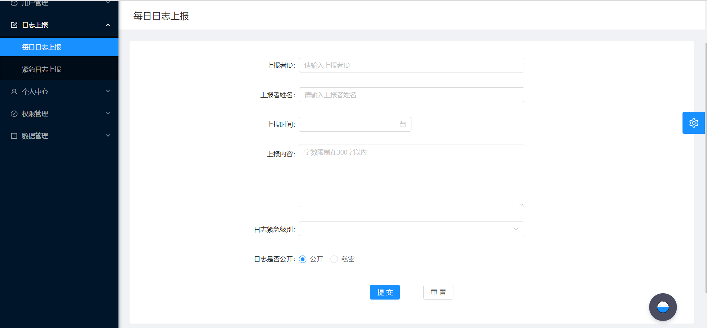

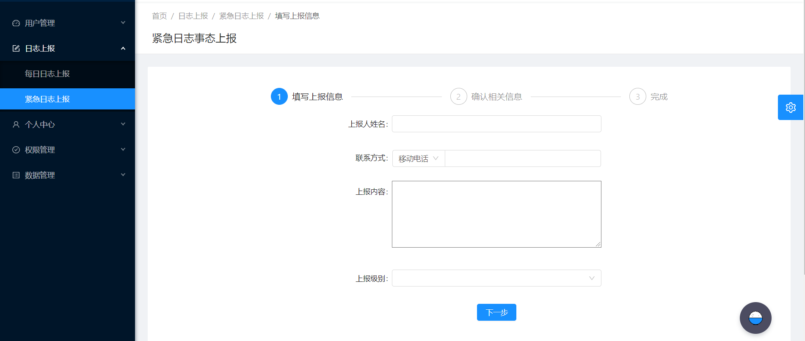

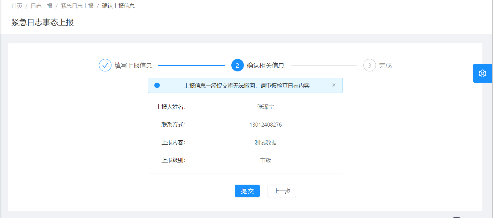

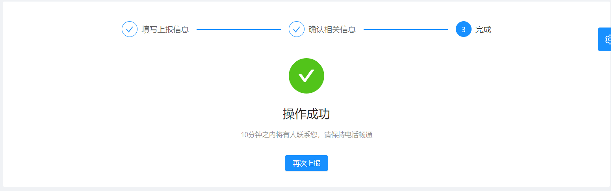

### 用户登录数据可视化模块

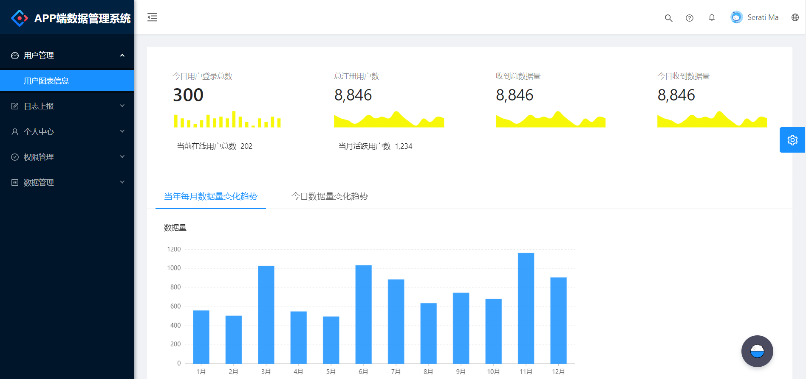

### 用户权限管理模块

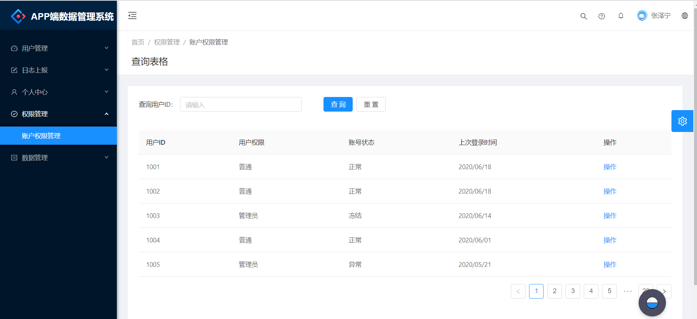

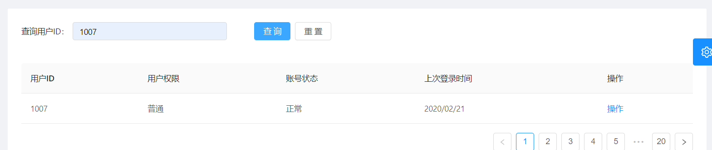

### 个人中心模块

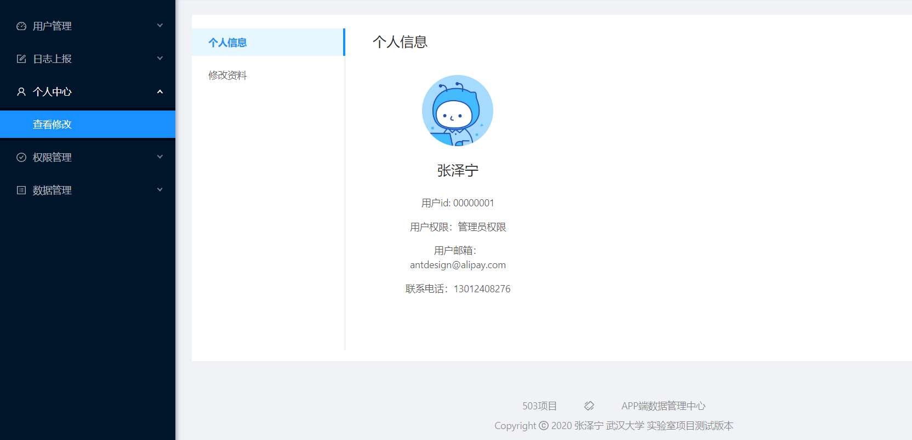

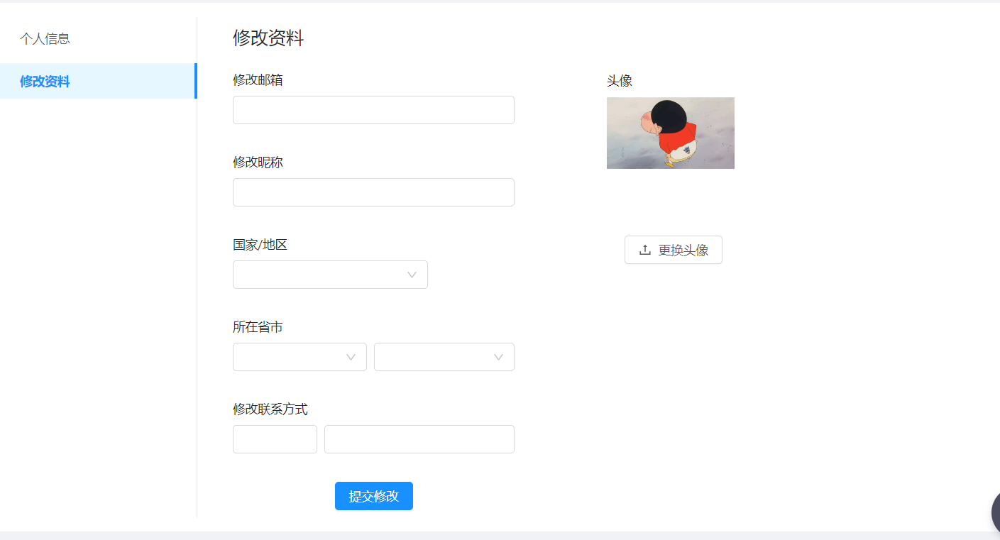

### APP采集数据查询模块

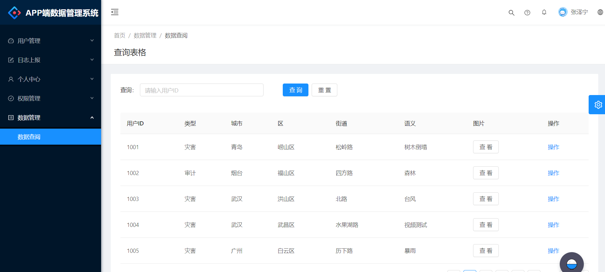

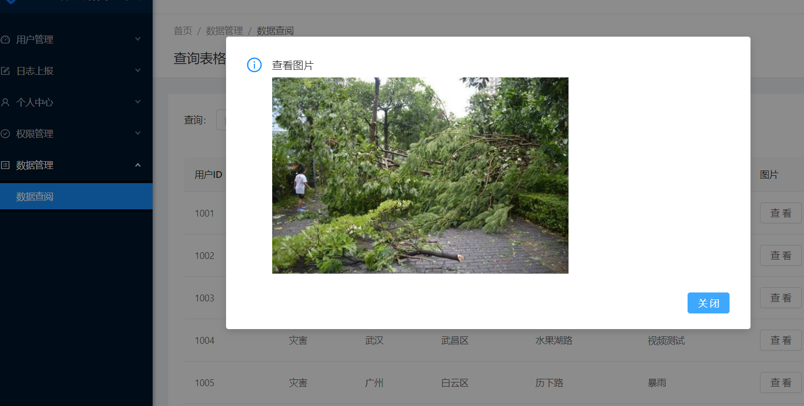

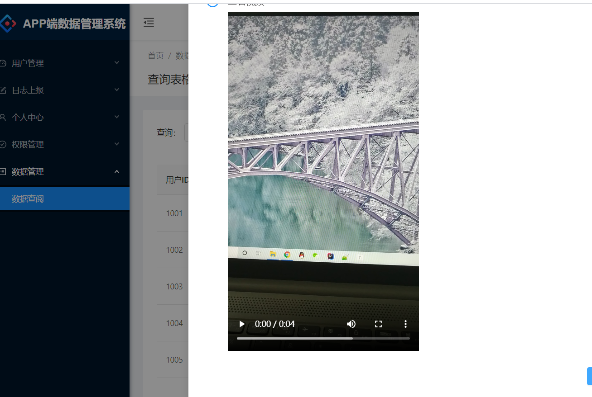

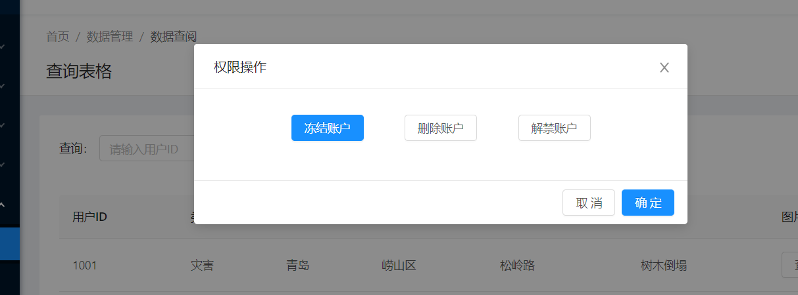